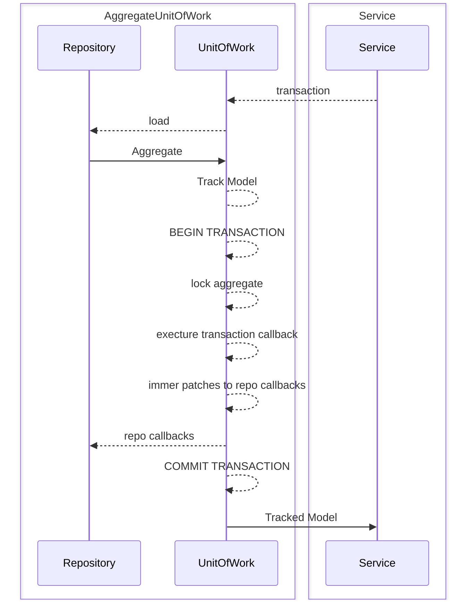

```mermaid
 sequenceDiagram
    box AggregateUnitOfWork
    participant Repository
    participant UnitOfWork
    end

    box Service
    participant Service
    end

    Service-->>UnitOfWork: transaction
    UnitOfWork-->>Repository: load
    Repository->>UnitOfWork: Aggregate
    UnitOfWork-->UnitOfWork: Track Model
    UnitOfWork-->>UnitOfWork: BEGIN TRANSACTION
    UnitOfWork-->>UnitOfWork: lock aggregate
    UnitOfWork-->>UnitOfWork: execture transaction callback
    UnitOfWork-->>UnitOfWork: immer patches to repo callbacks
    UnitOfWork-->>Repository: repo callbacks
    UnitOfWork-->>UnitOfWork: COMMIT TRANSACTION
    UnitOfWork->>Service: Tracked Model
```